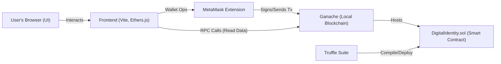

# Project Documentation: Decentralized Digital Identity Management System

**Version:** 1.1
**Date:** May 16, 2024
**Author(s):** Abdelrahman Ayman, Abdelrahman Elkady, Youssef Bayoumy, Youssef Nader, Marwan Hamdy, Marzie Micheal, Abdelrahman Waleed.
**Repository:** `https://github.com/didi-09/DigitalIDentity.git`

--------------------------------------------------------------------------------
1. OVERVIEW
--------------------------------------------------------------------------------

1.1. Introduction and Project Goal
-----------------------------------
This document details the design, architecture, implementation, and deployment
of a decentralized Digital Identity Management System. The primary goal of this
project is to create a foundational DApp (Decentralized Application) that
allows users to associate a simple digital identity (consisting of a name and
email address) with their unique Ethereum wallet address. This identity is
recorded and managed on an Ethereum-compatible blockchain, ensuring data
immutability, transparency (for public data), and user control over their
identity information.

The system aims to demonstrate core blockchain concepts such as smart contract
interactions, wallet integration, transaction signing, and decentralized data
storage for a practical use case.

1.2. Core Features
-------------------
The DApp provides the following key functionalities:

*   **Wallet Integration:** Users can connect their existing Ethereum-compatible
    wallets (e.g., MetaMask) to interact with the application. The connected
    wallet address serves as the primary identifier for the user within the
    system.
*   **Identity Registration:** A user can register a unique digital identity by
    providing their name and email. This identity is then immutably linked to
    their wallet address on the blockchain. The system prevents an address from
    registering more than one identity.
*   **Identity Update:** Users who have already registered an identity can update
    their associated name and/or email address. Only the owner of the Ethereum
    address linked to an identity can perform updates.
*   **Identity Viewing:** Any user (or external service) can query the blockchain
    to view the registered name and email associated with a given Ethereum
    address, provided an identity has been registered for that address.
*   **Decentralized Data Persistence:** All identity data is stored directly on
    the blockchain within the smart contract's storage, leveraging the
    security and immutability features of the distributed ledger.
*   **Event Emission:** The smart contract emits events upon successful identity
    registration and updates, allowing off-chain services or frontends to
    listen and react to these changes.

1.3. Technology Stack
----------------------
The project utilizes the following technologies:

*   **Blockchain Platform:** Ethereum (simulated locally using Ganache)
    *   Ganache: Personal blockchain for Ethereum development, providing local
      test accounts and a simulated network environment.
*   **Smart Contract Development:**
    *   Language: Solidity (version 0.8.18)
    *   Framework: Truffle Suite (for compilation, deployment, testing, and
      artifact management)
*   **Frontend Development:**
    *   Structure: HTML5
    *   Styling: CSS3 (custom styling for a modern UI)
    *   Logic: JavaScript (ES6+)
    *   Blockchain Interaction Library: Ethers.js (version 6.x)
    *   Build Tool/Development Server: Vite
*   **Wallet Integration:**
    *   MetaMask: Browser extension acting as the user's wallet and interface
      for signing transactions and interacting with the DApp.
*   **Development Environment:**
    *   Node.js: JavaScript runtime environment (LTS version recommended).
    *   npm (Node Package Manager): For managing project dependencies.
    *   Code Editor: Visual Studio Code (VS Code) is recommended with Solidity
      and JavaScript extensions.
      
--------------------------------------------------------------------------------
2. ARCHITECTURE
--------------------------------------------------------------------------------

2.1. System Components Diagram
-----------------------------



### 2.2. Detailed Component Description

*   **2.2.1. User's Browser:**
 *   **Role:** Hosts the frontend application and the MetaMask extension.
 *   **Interaction:** Renders the HTML/CSS and executes the JavaScript logic of the frontend. Facilitates user input and displays DApp information.

*   **2.2.2. Frontend Application (`digital-identity-frontend-truffle`):**
 *   **Role:** Provides the User Interface (UI) and User Experience (UX) for interacting with the digital identity system.
 *   **Technologies:** Built with HTML, CSS, and modern JavaScript. Vite is used as a development server and build tool.
 *   **Functionality:**
     *   Renders forms for identity registration and updates.
     *   Displays identity information and system status/errors.
     *   Manages user interactions (button clicks, form submissions).
     *   Uses Ethers.js to communicate with the MetaMask extension and, through it, the blockchain.

*   **2.2.3. MetaMask Browser Extension:**
 *   **Role:** Acts as the bridge between the frontend application and the Ethereum blockchain (Ganache in this case). It also serves as the user's digital wallet.
 *   **Functionality:**
     *   Manages the user's Ethereum accounts and private keys securely.
     *   Injects an Ethereum provider (`window.ethereum`) into the browser, which Ethers.js uses to detect the wallet and network.
     *   Prompts the user to approve or reject transactions initiated by the frontend.
     *   Signs transactions with the user's private key before they are broadcast to the network.
     *   Allows users to switch between different Ethereum networks.

*   **2.2.4. Ethers.js Library:**
 *   **Role:** A comprehensive JavaScript library for interacting with the Ethereum blockchain and its ecosystem.
 *   **Usage in Frontend:**
     *   Creating a `Provider` to connect to the Ethereum network via MetaMask.
     *   Getting a `Signer` object to represent the user's connected account, enabling transaction signing.
     *   Instantiating a `Contract` object using the smart contract's ABI and deployed address, allowing for easy interaction with contract functions.
     *   Formatting data and handling responses from the blockchain.

*   **2.2.5. Ganache (Local Blockchain):**
 *   **Role:** A personal Ethereum blockchain for local development and testing.
 *   **Functionality:**
     *   Simulates the Ethereum Virtual Machine (EVM) environment.
     *   Provides a set of pre-funded test accounts with "fake" ETH.
     *   Processes transactions and executes smart contract code locally, allowing for rapid iteration without real gas costs.
     *   Offers an RPC (Remote Procedure Call) endpoint (e.g., `http://127.0.0.1:7545`) for applications like MetaMask and Truffle to connect to.
     *   Ganache UI provides a graphical interface to inspect blocks, transactions, accounts, and contract state.

*   **2.2.6. DigitalIdentity Smart Contract (`DigitalIdentity.sol`):**
 *   **Role:** The backend logic and data store of the DApp, deployed on the Ganache blockchain.
 *   **Functionality:**
     *   Defines the data structure (`Identity` struct) for storing user identities.
     *   Implements functions for `registerIdentity`, `updateIdentity`, and `getIdentity`.
     *   Manages state variables (the `identities` mapping).
     *   Enforces business rules (e.g., one identity per address, owner-only updates) using modifiers and `require` statements.
     *   Emits events for significant actions.

*   **2.2.7. Truffle Suite:**
 *   **Role:** A development environment, testing framework, and asset pipeline for Ethereum smart contracts.
 *   **Functionality:**
     *   **Compilation:** Compiles Solidity (`.sol`) smart contracts into EVM bytecode and generates Application Binary Interfaces (ABIs).
     *   **Migration (Deployment):** Provides a system for scripting deployments of smart contracts to various Ethereum networks (including Ganache).
     *   **Testing:** Facilitates writing automated tests for smart contracts in JavaScript or Solidity (not extensively covered in this project's current phase).
     *   **Artifact Management:** Stores compiled contract information (ABI, bytecode, deployed addresses) in `build/contracts/` JSON files.

### 2.3. Data and Control Flow

*   **2.3.1. User Connecting Wallet:**
 1.  User clicks "Connect Wallet" on the frontend.
 2.  Frontend (`main.js`) calls `provider.send("eth_requestAccounts", [])` via Ethers.js.
 3.  MetaMask prompts the user to select an account and approve the connection.
 4.  If approved, MetaMask provides the selected account address to the frontend.
 5.  Frontend updates the UI and initializes the Ethers.js `Signer` and `Contract` objects.

*   **2.3.2. Registering/Updating an Identity (Write Operation):**
 1.  User fills the form and clicks "Register" or "Update".
 2.  Frontend gathers input data.
 3.  Frontend calls the corresponding smart contract function (e.g., `contract.registerIdentity(name, email)`) using the Ethers.js `Contract` object (which uses the `Signer`).
 4.  Ethers.js prepares the transaction data.
 5.  MetaMask pops up, displaying transaction details (including estimated gas) and prompts the user for confirmation.
 6.  User confirms and signs the transaction in MetaMask.
 7.  MetaMask submits the signed transaction to the connected Ganache RPC endpoint.
 8.  Ganache receives the transaction, validates it, and includes it in a new block (if valid).
 9.  The `DigitalIdentity` smart contract function is executed by the EVM on Ganache, potentially changing the contract's state (e.g., adding/updating an entry in the `identities` mapping).
 10. The smart contract may emit an event (e.g., `IdentityRegistered`).
 11. Frontend receives a transaction hash and can `await tx.wait()` for confirmation that the transaction has been mined.
 12. Frontend updates the UI to reflect the success or failure.

*   **2.3.3. Viewing an Identity (Read Operation):**
 1.  User enters an Ethereum address and clicks "View Identity".
 2.  Frontend calls the `contract.getIdentity(addressToView)` function using the Ethers.js `Contract` object (can use a `Provider` or `Signer` for read calls).
 3.  Ethers.js sends a JSON-RPC `eth_call` request to the Ganache RPC endpoint (via MetaMask's provider).
 4.  Ganache executes the `getIdentity` view function locally (without creating a new transaction or block) and returns the requested data.
 5.  Frontend receives the identity data (name, email, registration status).
 6.  Frontend updates the UI to display the information.

*   **2.3.4. Smart Contract Deployment (via Truffle):**
 1.  Developer runs `truffle compile`. Truffle compiles `DigitalIdentity.sol` into bytecode and ABI, saving them in `build/contracts/`.
 2.  Developer runs `truffle migrate --network <ganache_network_name>`.
 3.  Truffle reads the migration script (e.g., `2_deploy_digital_identity.js`).
 4.  Truffle connects to the Ganache instance specified in `truffle-config.js`.
 5.  Truffle sends a transaction to Ganache to deploy the `DigitalIdentity` contract bytecode.
 6.  Ganache creates the contract on its blockchain and returns the contract address.
 7.  Truffle records the deployment and updates the artifact JSON file in `build/contracts/` with the deployed address on that network.
--------------------------------------------------------------------------------
3. SMART CONTRACT (`DigitalIdentity.sol`) DEEP DIVE
--------------------------------------------------------------------------------


### 3.1. File Location and Purpose
*   **File Path:** `truffle-digital-identity/contracts/DigitalIdentity.sol`
*   **Purpose:** This Solidity smart contract serves as the core backend logic for the Digital Identity DApp. It is responsible for securely storing and managing user identity data (name and email) on the blockchain, associating it with unique Ethereum addresses. It defines the rules and interfaces for registering, updating, and retrieving these identities.

### 3.2. Compiler Directives

    3.2.1. SPDX License Identifier
        ```solidity
        // SPDX-License-Identifier: MIT
        ```
        *   **Description:** Declares the open-source license (MIT License) under which the contract's source code is distributed. This is a best practice for transparency and legal clarity.

    3.2.2. Pragma Version
        ```solidity
        pragma solidity ^0.8.18;
        ```
        *   **Description:** Specifies the Solidity compiler version(s) compatible with this contract code. The caret `^` indicates that the contract can be compiled with version 0.8.18 and any subsequent patch versions (e.g., 0.8.19) but not with breaking changes introduced in version 0.9.0 or higher.

### 3.3. Contract Definition
    ```solidity
    contract DigitalIdentity {
        // ... (structs, state variables, events, modifiers, functions) ...
    }
    ```
    *   **Description:** The `contract DigitalIdentity { ... }` block encapsulates all the state, logic, and interface definitions for the digital identity system.

### 3.4. Data Structures

    3.4.1. `Identity` Struct
        ```solidity
        struct Identity {
            address owner;        // The Ethereum address owning this identity
            string name;          // The name associated with the identity
            string email;         // The email associated with the identity
            bool isRegistered;    // Flag indicating if this identity slot is active
        }
        ```
        *   **Purpose:** Defines a custom data type to represent a single user's digital identity, grouping related information.
        *   **Fields:**
            *   `owner (address)`: The Ethereum address of the identity holder.
            *   `name (string)`: The user's registered name.
            *   `email (string)`: The user's registered email address.
            *   `isRegistered (bool)`: A flag (`true`/`false`) indicating whether an identity has been formally registered for the `owner` address.

### 3.5. State Variables

    3.5.1. `identities` Mapping
        ```solidity
        mapping(address => Identity) public identities;
        ```
        *   **Purpose:** The primary data storage for the contract, associating Ethereum addresses with their `Identity` struct.
        *   **Type and Behavior:** `mapping(address => Identity)` acts like a hash table. Accessing an unassigned address returns a default (zeroed) `Identity` struct.
        *   **Visibility (`public`):** Automatically generates a public getter function `identities(address)` to retrieve the `Identity` struct for a given address.

### 3.6. Events

    3.6.1. `IdentityRegistered` Event
        ```solidity
        event IdentityRegistered(
            address indexed owner,
            string name,
            string email
        );
        ```
        *   **Purpose:** Emitted upon successful registration of a new identity via `registerIdentity`.
        *   **Parameters:**
            *   `owner (address indexed)`: The address of the registered user (indexed for efficient searching).
            *   `name (string)`: The registered name.
            *   `email (string)`: The registered email.

    3.6.2. `IdentityUpdated` Event
        ```solidity
        event IdentityUpdated(
            address indexed owner,
            string newName,
            string newEmail
        );
        ```
        *   **Purpose:** Emitted upon successful update of an existing identity via `updateIdentity`.
        *   **Parameters:**
            *   `owner (address indexed)`: The address whose identity was updated (indexed).
            *   `newName (string)`: The new name.
            *   `newEmail (string)`: The new email.

### 3.7. Modifiers

    3.7.1. `notAlreadyRegistered` Modifier
        ```solidity
        modifier notAlreadyRegistered() {
            require(!identities[msg.sender].isRegistered, "Identity: Address already registered.");
            _; // Placeholder for the modified function's body
        }
        ```
        *   **Purpose:** Restricts function execution (e.g., `registerIdentity`) to callers (`msg.sender`) who have not yet registered.
        *   **Logic:** Reverts if `identities[msg.sender].isRegistered` is `true`. If `false`, proceeds to the function body (`_`).

    3.7.2. `isRegistered` Modifier
        ```solidity
        modifier isRegistered() {
            require(identities[msg.sender].isRegistered, "Identity: Address not registered.");
            _;
        }
        ```
        *   **Purpose:** Restricts function execution (e.g., `updateIdentity`) to callers (`msg.sender`) who already have a registered identity.
        *   **Logic:** Reverts if `identities[msg.sender].isRegistered` is `false`. If `true`, proceeds to the function body (`_`).

### 3.8. Functions (Public Interface)

    3.8.1. `registerIdentity(string memory _name, string memory _email)`
        ```solidity
        function registerIdentity(string memory _name, string memory _email)
            public
            notAlreadyRegistered
        {
            identities[msg.sender] = Identity({
                owner: msg.sender,
                name: _name,
                email: _email,
                isRegistered: true
            });
            emit IdentityRegistered(msg.sender, _name, _email);
        }
        ```
        *   **Purpose:** Allows `msg.sender` to register their identity.
        *   **Parameters:** `_name` (string), `_email` (string).
        *   **Visibility:** `public`.
        *   **Modifiers Applied:** `notAlreadyRegistered`.
        *   **Logic:** Creates a new `Identity` struct, stores it in the `identities` mapping for `msg.sender`, and emits `IdentityRegistered`.
        *   **State Mutability:** State-changing (requires gas).

    3.8.2. `updateIdentity(string memory _newName, string memory _newEmail)`
        ```solidity
        function updateIdentity(string memory _newName, string memory _newEmail)
            public
            isRegistered
        {
            identities[msg.sender].name = _newName;
            identities[msg.sender].email = _newEmail;
            emit IdentityUpdated(msg.sender, _newName, _newEmail);
        }
        ```
        *   **Purpose:** Allows a registered `msg.sender` to update their identity.
        *   **Parameters:** `_newName` (string), `_newEmail` (string).
        *   **Visibility:** `public`.
        *   **Modifiers Applied:** `isRegistered`.
        *   **Logic:** Updates the `name` and `email` fields for `msg.sender`'s stored identity and emits `IdentityUpdated`.
        *   **State Mutability:** State-changing (requires gas).

    3.8.3. `getIdentity(address _owner)`
        ```solidity
        function getIdentity(address _owner)
            public
            view
            returns (
                string memory name,
                string memory email,
                bool isRegistered_
            )
        {
            Identity storage id = identities[_owner];
            return (id.name, id.email, id.isRegistered);
        }
        ```
        *   **Purpose:** Retrieves identity details for a given `_owner` address.
        *   **Parameters:** `_owner (address)`.
        *   **Visibility:** `public`.
        *   **State Mutability:** `view` (read-only, no gas cost for external calls).
        *   **Return Values:** `name` (string), `email` (string), `isRegistered_` (bool).
        *   **Logic:** Reads and returns data from the `identities` mapping.

    3.8.4. `isIdentityRegistered(address _owner)`
        ```solidity
        function isIdentityRegistered(address _owner) public view returns (bool) {
            return identities[_owner].isRegistered;
        }
        ```
        *   **Purpose:** Checks if an identity is registered for a given `_owner`.
        *   **Parameters:** `_owner (address)`.
        *   **Visibility:** `public`.
        *   **State Mutability:** `view`.
        *   **Return Value:** `bool` (`true` if registered, `false` otherwise).
        *   **Logic:** Returns the `isRegistered` flag from the `identities` mapping.

--------------------------------------------------------------------------------
4. TRUFFLE PROJECT SETUP & CONFIGURATION
--------------------------------------------------------------------------------

### 4.1. Overview of Truffle Suite
*   **Purpose:** Truffle is a comprehensive development environment, testing framework, and asset pipeline specifically designed for smart contracts targeting the Ethereum Virtual Machine (EVM). It simplifies common tasks in the smart contract development lifecycle.
*   **Role in Project:** This project utilizes Truffle for managing the `DigitalIdentity.sol` smart contract, including its compilation, deployment (migrations), and providing an organized project structure.

### 4.2. Project Initialization and Directory Structure
*   **Project Root:** The Git repository root is `my-truffle-digital-identity/`.
*   **Initialization:** This project was set up by running `truffle init` within the `my-truffle-digital-identity/` directory and then adding frontend components as subdirectories.
*   **Directory Layout (`my-truffle-digital-identity/`):**
    ```
    my-truffle-digital-identity/
    ├── build/                            # Truffle: Compiled contract artifacts
    │   └── contracts/
    │       └── DigitalIdentity.json
    ├── contracts/                        # Truffle: Solidity source files
    │   └── DigitalIdentity.sol
    ├── digital-identity-frontend-truffle/  # Frontend: Vite project
    │   ├── public/
    │   ├── src/
    │   │   ├── DigitalIdentityABI.json
    │   │   ├── main.js
    │   │   └── style.css
    │   ├── index.html
    │   └── package.json
    ├── migrations/                       # Truffle: JavaScript deployment scripts
    │   └── 2_deploy_digital_identity.js  # (or 1_ if no default migration)
    ├── node_modules/                     # Node.js dependencies (for Truffle and potentially frontend if not separate)
    ├── test/                             # Truffle: Contract test files
    ├── package.json                      # npm package file for the root/Truffle project
    ├── package-lock.json                 # npm lock file
    ├── truffle-config.js                 # Truffle: Main configuration file
    └── README.md                         # This file
    ```
    *(Note: The `digital-identity-dapp-main` folder seen in your `ls` output is not explicitly part of this core DApp structure unless it serves a specific documented purpose. If it's a remnant or a different project, it might not need to be in this structural overview for *this* DApp's README.)*

    *   **4.2.1. Key Directories & Files Explained (within `my-truffle-digital-identity/`):**
        *   **`contracts/`**: Contains the Solidity source code for the smart contract(s), primarily `DigitalIdentity.sol`.
        *   **`migrations/`**: Holds JavaScript files that script the deployment (migration) of smart contracts to the blockchain.
        *   **`build/contracts/`**: (Generated by `truffle compile`) Stores JSON artifacts for each compiled contract, including its ABI (Application Binary Interface), bytecode, and deployment information on various networks. The ABI is crucial for the frontend to interact with the contract.
        *   **`test/`**: Designated for writing automated tests for the smart contracts.
        *   **`truffle-config.js`**: The central configuration file for the Truffle framework, defining network connections (like Ganache), Solidity compiler versions, and other project settings.
        *   **`digital-identity-frontend-truffle/`**: This subdirectory contains the complete frontend application.
            *   `src/`: Contains the frontend's source code (JavaScript, CSS, contract ABI).
            *   `index.html`: The main entry point for the frontend web page.
            *   `package.json`: Manages the frontend's specific npm dependencies (like Vite and Ethers.js).
        *   **`node_modules/`**: (At the root and potentially within the frontend) Stores downloaded npm packages (dependencies). This directory **should be in your `.gitignore` file**.
        *   **`package.json` / `package-lock.json` (at the root):** Likely associated with Truffle itself or any root-level Node.js dependencies.

### 4.3. Truffle Configuration (`truffle-config.js`)
*   **Purpose:** This file dictates how Truffle interacts with blockchains and compiles Solidity contracts.
*   **4.3.1. Example `truffle-config.js` Structure:**
    ```javascript
    // truffle-digital-identity/truffle-config.js
    module.exports = {
      networks: {
        development: { // Configuration for the local Ganache network
          host: "127.0.0.1",       // IP address for the local Ethereum client (Ganache)
          port: 7545,              // Port for Ganache UI (default). Use 8545 for Ganache CLI.
                                   // **CRITICAL: Must match your running Ganache instance.**
          network_id: "*",         // Wildcard to match any network ID.
                                   // Can be set to specific ID like 5777 (Ganache UI) or 1337 (Ganache CLI).
        },
        // Additional network configurations (e.g., for testnets) can be added here.
      },

      mocha: { // Optional configuration for Mocha test framework
        // timeout: 100000
      },

      compilers: {
        solc: {
          version: "0.8.18", // Solidity compiler version.
                               // **CRITICAL: Must be compatible with 'pragma solidity ^0.8.18;' in .sol file.**
          settings: {
            optimizer: {
              enabled: false, // Set to true for production deployments to optimize gas.
              runs: 200       // Number of optimizer runs.
            },
            // evmVersion: "istanbul" // (Optional) Specify target EVM version.
          }
        }
      }
    };
    ```
*   **4.3.2. `networks` Configuration:**
    *   The `networks` object defines connection parameters for Ethereum blockchains.
    *   **`development` Network:** Conventionally used for local development (e.g., Ganache).
        *   `host`: IP address of the blockchain client (e.g., `127.0.0.1` for local Ganache).
        *   `port`: Port number of the RPC server (e.g., `7545` for Ganache UI). **Must match your Ganache setup.**
        *   `network_id`: The target network's ID. `"*"` matches any. Specific IDs (e.g., `5777`, `1337`) can be used for precision.
*   **4.3.3. `compilers.solc` Configuration:**
    *   This section configures the Solidity compiler (`solc`).
    *   `version`: Specifies the exact `solc` version (e.g., `"0.8.18"`). Must align with the `pragma` in your `.sol` files.
    *   `settings.optimizer`: Configures the Solidity optimizer. `enabled: true` is recommended for production to reduce gas costs. `runs` influences the optimization strategy.

### 4.4. Deployment (Migration) Scripts
*   **Purpose:** JavaScript files in `migrations/` that automate smart contract deployment, executed numerically.
*   **4.4.1. Example Migration Script (`migrations/2_deploy_digital_identity.js`):**
    ```javascript
    // truffle-digital-identity/migrations/2_deploy_digital_identity.js
    const DigitalIdentity = artifacts.require("DigitalIdentity");

    module.exports = function (deployer, network, accounts) {
      deployer.deploy(DigitalIdentity)
        .then(() => {
          console.log("\n🚀 DigitalIdentity Contract Deployed Successfully!");
          console.log("----------------------------------------------------");
          console.log(`   Network         : ${network}`);
          console.log(`   Contract Address: ${DigitalIdentity.address}`); // Crucial for frontend
          console.log(`   Deployed By     : ${accounts[0]}`); // Usually the first Ganache account
          console.log("----------------------------------------------------\n");
        })
        .catch(error => {
          console.error("🚨 Deployment Failed for DigitalIdentity Contract:");
          console.error(error);
        });
    };
    ```
*   **4.4.2. Explanation of the Migration Script:**
    *   **`artifacts.require("DigitalIdentity")`**: Loads the compiled contract abstraction (ABI, bytecode). The name must match the contract name in `DigitalIdentity.sol`.
    *   **`module.exports = function (deployer, network, accounts)`**: Standard Truffle migration function signature. Truffle injects:
        *   `deployer`: Object for orchestrating deployments.
        *   `network`: String name of the target network.
        *   `accounts`: Array of available accounts on that network.
    *   **`deployer.deploy(DigitalIdentity)`**: Deploys the `DigitalIdentity` contract. Returns a Promise. Constructor arguments, if any, would follow `DigitalIdentity`.
    *   **`.then(() => { ... })`**: Executes on successful deployment. Logs deployment details, including the vital `DigitalIdentity.address`.
    *   **`.catch(error => { ... })`**: Handles deployment errors.
    
    --------------------------------------------------------------------------------
5. FRONTEND APPLICATION
--------------------------------------------------------------------------------

### 5.1. Purpose and Overview
*   **Purpose:** The frontend application serves as the primary user interface (UI) enabling users to interact with the `DigitalIdentity` smart contract deployed on the Ganache blockchain.
*   **Technology Stack:** It is a Single Page Application (SPA) built using standard web technologies: HTML5 for structure, CSS3 for styling (with a custom modern theme), and JavaScript (ES6+) for dynamic behavior and logic.
*   **Blockchain Interaction:** Ethers.js (version 6.x) is utilized as the JavaScript library to communicate with the Ethereum blockchain via the user's MetaMask wallet.
*   **Development Environment:** Vite is employed as the frontend build tool and development server, offering features like Hot Module Replacement (HMR) for a fast development workflow.
*   **Project Location:** This application resides in a dedicated directory, typically named `digital-identity-frontend-truffle`, which can be structured as a sibling to or nested within the main Truffle project directory.

### 5.2. Project Structure and Key Files
*   **Main Directory:** `digital-identity-frontend-truffle/`
*   **Key Files and Directories:**
    *   **`index.html`**: The single HTML entry point for the application. It defines the page's basic structure, including forms, buttons, and areas for displaying dynamic content. It also links to the CSS and JavaScript files.
    *   **`src/`**: The source code directory.
        *   **`main.js`**: The core JavaScript file. It contains all the client-side logic for wallet connection (MetaMask), smart contract interactions using Ethers.js, handling user input, and dynamically updating the UI.
        *   **`style.css`**: Contains all the custom CSS rules that define the visual appearance, layout, and modern styling of the DApp.
        *   **`DigitalIdentityABI.json`**: A crucial JSON file that stores **only the ABI array** (Application Binary Interface) of the compiled `DigitalIdentity` smart contract. This ABI is copied from the Truffle project's build artifacts (`build/contracts/DigitalIdentity.json`) and is necessary for Ethers.js to understand how to encode calls to and decode responses from the smart contract.
    *   **`public/`**: (Optional, created by Vite) For static assets that are copied directly to the build output.
    *   **`package.json`**: The Node.js project manifest file for the frontend. It lists project dependencies (e.g., `vite`, `ethers`), defines npm scripts (like `npm run dev` to start the development server), and holds project metadata.
    *   **`vite.config.js`**: (Optional) Vite's configuration file. For this basic project, default Vite settings are often sufficient, so this file might not be explicitly created or modified.

### 5.3. Core Frontend Logic (`src/main.js`)

    5.3.1. Essential Constants and Imports:
        *   **Imports:**
            ```javascript
            import { ethers } from "ethers";
            import DigitalIdentityABI from './DigitalIdentityABI.json';
            ```
        *   **Configuration Constants:**
            ```javascript
            const CONTRACT_ADDRESS = "0xYourDeployedContractAddressOnGanache"; // MUST BE UPDATED MANUALLY
            const TARGET_NETWORK_ID = "1337"; // MUST MATCH YOUR GANACHE CHAIN ID
            ```
            *   `CONTRACT_ADDRESS`: Holds the blockchain address where the `DigitalIdentity` smart contract was deployed by Truffle. This needs to be manually updated in the script after each new deployment if the address changes.
            *   `TARGET_NETWORK_ID`: Specifies the Chain ID of the Ganache network the DApp is intended to interact with. This is used to verify that MetaMask is connected to the correct network.

    5.3.2. DOM Element Selection:
        *   JavaScript variables are declared and assigned references to various HTML elements (buttons, input fields, display divs) using `document.getElementById()`. This allows the script to manipulate these elements and listen for user interactions.

    5.3.3. Application State Variables:
        *   `provider (ethers.BrowserProvider)`: Represents the connection to the Ethereum network, typically established through `window.ethereum` injected by MetaMask.
        *   `signer (ethers.Signer)`: Represents the user's connected Ethereum account, capable of signing transactions. Obtained from the `provider`.
        *   `contract (ethers.Contract)`: An Ethers.js object representing the deployed `DigitalIdentity` smart contract, instantiated with its address, ABI, and a signer (for write operations) or provider (for read operations).
        *   `currentAccount (string | null)`: Stores the address of the currently connected user account.

    5.3.4. Initialization Function (`async function init()`):
        *   **Trigger:** Executed when the HTML DOM is fully loaded (`DOMContentLoaded` event).
        *   **Responsibilities:**
            1.  Displays the configured `CONTRACT_ADDRESS` and `TARGET_NETWORK_ID` in the UI.
            2.  Checks for the presence of `window.ethereum` to detect MetaMask.
            3.  If MetaMask is present, initializes the `provider`.
            4.  Attempts to retrieve already authorized accounts (`eth_accounts`) to facilitate an automatic connection if the user previously granted permission and is on the correct network.
            5.  Calls `updateWalletActionButtons()` to set the initial state of connect/disconnect buttons.

    5.3.5. Wallet Connection Logic (`async function connectWallet()`, `async function handleConnection(account)`, `function disconnectWallet()`, `function updateWalletActionButtons()`, `function resetDappState()`):
        *   **`updateWalletActionButtons()`:** Dynamically creates and displays either the "Connect Wallet" or "Disconnect Wallet" button in the `walletActionsSpan` based on whether `currentAccount` is set. Attaches appropriate event listeners.
        *   **`connectWallet()`:**
            1.  Verifies MetaMask is connected to the `TARGET_NETWORK_ID`.
            2.  Requests account access from MetaMask using `provider.send("eth_requestAccounts", [])`.
            3.  If successful, calls `handleConnection()` with the selected account.
        *   **`handleConnection(account)`:**
            1.  Sets `currentAccount`, obtains the `signer`.
            2.  Updates UI to show connected account and switches to "Disconnect Wallet" button.
            3.  Instantiates the `contract` object.
            4.  Calls `loadCurrentUserIdentity()` to pre-fill update form if applicable.
        *   **`disconnectWallet()`:** Calls `resetDappState()`.
        *   **`resetDappState()`:** Clears `currentAccount`, `signer`, `contract`; resets UI elements to their disconnected state, and shows the "Connect Wallet" button.

    5.3.6. Smart Contract Interaction Logic (Event Listeners for Register, Update, View):
        *   **General Pattern for Write Operations (`registerIdentity`, `updateIdentity`):**
            1.  An `async` event listener function is attached to the respective button.
            2.  It first checks if `contract` and `signer` are available (wallet connected).
            3.  Retrieves and validates user input from form fields.
            4.  Displays a "Sending transaction..." status message.
            5.  Calls the corresponding method on the Ethers.js `contract` object (e.g., `await contract.registerIdentity(name, email)`). This sends the transaction via MetaMask.
            6.  MetaMask prompts the user to confirm and sign.
            7.  The function awaits transaction confirmation using `await tx.wait()`, where `tx` is the transaction response.
            8.  Upon confirmation, updates the UI with a success message and may refresh relevant data (e.g., `loadCurrentUserIdentity()`).
            9.  Catches errors and calls `handleContractError()`.
        *   **General Pattern for Read Operations (`getIdentity`, `loadCurrentUserIdentity`):**
            1.  An `async` event listener function or helper function.
            2.  Checks for necessary objects (`contract`, `provider`).
            3.  Calls the `view` method on the `contract` object (e.g., `await contract.getIdentity(address)`). For reads, the contract instance can be associated with just a `provider`.
            4.  The function directly returns the requested data from the blockchain (no transaction mining).
            5.  Updates the UI to display the retrieved information.
            6.  Catches errors and calls `handleContractError()`.

    5.3.7. UI Update and Helper Functions:
        *   **`loadCurrentUserIdentity()`:** Fetches and displays the connected user's identity information in the "Update My Identity" form fields if they are already registered.
        *   **`showStatus(message)`:** Displays informational status messages in a designated UI element.
        *   **`showError(message)`:** Displays error messages in a designated UI element.
        *   **`handleContractError(error, prefix)`:** A utility function to parse error objects from Ethers.js or MetaMask and display a more user-friendly error message. Attempts to extract revert reasons.

    5.3.8. MetaMask Event Listeners (`window.ethereum.on('accountsChanged', ...)` and `window.ethereum.on('chainChanged', ...)`):
        *   **`accountsChanged`:** Listens for the user switching accounts in MetaMask. If an account is selected, it attempts to reconnect the DApp with the new account (via `handleConnection`). If all accounts are disconnected, it resets the DApp state.
        *   **`chainChanged`:** Listens for the user switching networks in MetaMask. It checks if the new network matches `TARGET_NETWORK_ID`. If so, it may attempt to reconnect. If not, it resets the DApp state and prompts the user to switch to the correct network.

### 5.4. User Interface (`index.html` and `src/style.css`)
*   **5.4.1. `index.html` - Structure and Content:**
    *   Provides the semantic HTML structure for the DApp, including a header, main content area with distinct sections (cards for actions), and a footer for status messages.
    *   Contains forms with labeled `<input>` fields for name, email, and address.
    *   Includes `<button>` elements for user actions like "Connect Wallet", "Disconnect Wallet", "Register", "Update", and "View Identity".
    *   Utilizes `<span>` and `<div>` elements with specific IDs for dynamically displaying data (e.g., connected account address, contract address, identity details, status/error messages).
    *   Links to external resources like Google Fonts (e.g., "Inter") for typography.
    *   Links to the local `src/style.css` for styling and `src/main.js` (as a module) for functionality.
*   **5.4.2. `src/style.css` - Styling and Presentation:**
    *   Implements a modern, clean, and user-friendly visual design for all UI components.
    *   Defines a consistent color palette, typography, spacing, and layout rules.
    *   Uses a card-based design to visually group related content and actions.
    *   Styles form elements (inputs, labels) and buttons for enhanced usability and visual appeal, including hover and focus states for interactive elements.
    *   Includes basic responsive design features (e.g., using CSS Grid and media queries) to ensure the DApp is usable and looks presentable on various screen sizes, including smaller mobile devices.
    *   Provides distinct styling for status messages (e.g., informational blue) and error messages (e.g., warning red) for clear visual feedback.

### 5.5. Serving the Frontend (Vite)
*   **Development Server:** Vite is used as the frontend development server.
*   **Command to Start:** `npm run dev` (as defined in `digital-identity-frontend-truffle/package.json`).
*   **Key Features Utilized:**
    *   **Fast Startup:** Near-instant server start.
    *   **Hot Module Replacement (HMR):** Allows for quick updates in the browser during development without a full page reload when CSS or JavaScript modules are changed.
    *   **Optimized Build:** For production, `npm run build` creates optimized static assets.
    *   Serves static assets from the `public/` directory and processes files in `src/`.

--------------------------------------------------------------------------------
6. DEVELOPMENT ENVIRONMENT SETUP
--------------------------------------------------------------------------------

This section details the necessary tools, software, and steps required to set up a
local development environment for building, testing, and running the Digital
Identity DApp.

### 6.1. Prerequisites
Before proceeding with the project setup, ensure the following software is
installed and configured on your system:

*   **6.1.1. Node.js and npm (Node Package Manager):**
    *   **Purpose:** Node.js is a JavaScript runtime environment that allows you to
        run JavaScript code outside of a web browser. npm is the default package
        manager for Node.js, used for installing and managing project
        dependencies (like Truffle, Vite, Ethers.js) and running scripts.
    *   **Installation:** Download the latest Long-Term Support (LTS) version from
        the official Node.js website: [https://nodejs.org/](https://nodejs.org/). The installer typically includes npm.
    *   **Version Management (Highly Recommended):** Consider using a Node Version
        Manager such as NVM (Node Version Manager) for Linux/macOS or NVM-Windows
        for Windows. NVM allows you to install and switch between multiple
        Node.js versions easily, which is beneficial for managing different
        project requirements.
        *   NVM (Linux/macOS) Installation:
            ```bash
            curl -o- https://raw.githubusercontent.com/nvm-sh/nvm/v0.39.7/install.sh | bash
            # Close and reopen your terminal, or source your shell profile (e.g., source ~/.bashrc)
            nvm install --lts  # Installs the latest LTS version
            nvm use --lts      # Sets the LTS version as the current version
            ```
    *   **Verification:** After installation, open a terminal or command prompt and run:
        ```bash
        node -v
        npm -v
        ```
        These commands should display the installed versions of Node.js and npm,
        respectively.

*   **6.1.2. Truffle Suite:**
    *   **Purpose:** The primary development framework for Ethereum smart contracts
        used in this project. It handles compilation, deployment (migrations),
        and testing of Solidity contracts.
    *   **Installation:** Truffle is typically installed globally using npm:
        ```bash
        npm install -g truffle
        ```
    *   **Verification:**
        ```bash
        truffle version
        ```
        This command should display the installed Truffle Suite versions.

*   **6.1.3. Ganache:**
    *   **Purpose:** A personal blockchain for local Ethereum development. It
        simulates an Ethereum network, provides test accounts pre-funded with
        "fake" ETH, and allows for instant transaction mining.
    *   **Installation Options:**
        *   **Ganache UI (Graphical User Interface):** Recommended for a visual
            representation of blocks, transactions, and accounts. Download from
            the [Truffle Suite website](https://trufflesuite.com/ganache/).
        *   **Ganache CLI (Command Line Interface):** For developers who prefer
            working in the terminal or need to automate Ganache startup. Install
            globally via npm:
            ```bash
            npm install -g ganache
            # (Previously known as 'ganache-cli')
            ```
    *   **Choice:** The project can work with either the UI or CLI version. Ensure
        that the RPC port and Network ID (Chain ID) configured in Ganache are
        consistently used in `truffle-config.js` and MetaMask.

*   **6.1.4. MetaMask:**
    *   **Purpose:** A browser extension that functions as an Ethereum wallet and
        provides an interface for web applications (DApps) to interact with the
        blockchain.
    *   **Installation:** Install the MetaMask extension for your preferred web
        browser (e.g., Chrome, Firefox, Brave, Edge) from the official website:
        [https://metamask.io/](https://metamask.io/).
    *   **Initial Setup:** After installation, follow the MetaMask prompts to create
        a new wallet (and securely back up your seed phrase) or import an
        existing one. For this project, you will later configure MetaMask to
        connect to your local Ganache instance and import accounts from Ganache.

*   **6.1.5. Code Editor:**
    *   **Recommendation:** A modern code editor that supports JavaScript and
        Solidity is highly recommended. Visual Studio Code (VS Code) is a popular
        choice due to its extensive features, marketplace for extensions (such as
        Juan Blanco's "Solidity" extension for syntax highlighting and linting),
        and integrated terminal.
    *   **Download VS Code:** [https://code.visualstudio.com/](https://code.visualstudio.com/)

### 6.2. Project Initialization & Structure Setup
This describes setting up the project directories and initial files. If cloning
from an existing repository, some of these steps might already be done.

*   **6.2.1. Root Project Directory (e.g., `digital-identity-dapp-main`):**
    1.  Create a main parent directory for the entire project to house both the
        backend and frontend components if you prefer a monorepo-like structure.
        ```bash
        mkdir digital-identity-dapp-main
        cd digital-identity-dapp-main
        ```

*   **6.2.2. Truffle Project (Backend - `truffle-digital-identity`):**
    1.  **Create and Navigate to Directory:**
        (Either inside `digital-identity-dapp-main` or as a standalone directory)
        ```bash
        mkdir truffle-digital-identity
        cd truffle-digital-identity
        ```
    2.  **Initialize Truffle:**
        ```bash
        truffle init
        ```
        This command generates the standard Truffle project folders (`contracts/`,
        `migrations/`, `test/`) and the `truffle-config.js` file.
    3.  **Add Smart Contract (`DigitalIdentity.sol`):**
        Create the `DigitalIdentity.sol` file inside the `contracts/` directory
        and populate it with the Solidity code (as detailed in Section 3).
    4.  **Create Migration Script (`2_deploy_digital_identity.js`):**
        Create the deployment script file (e.g., `2_deploy_digital_identity.js` or
        `1_...` if you remove the default migration) inside the `migrations/`
        directory and add the JavaScript deployment code (as detailed in Section
        4.4).
    5.  **Configure `truffle-config.js`:**
        Modify `truffle-config.js` to specify the correct Solidity compiler
        version (e.g., `"0.8.18"`) and configure the `development` network (or a
        custom named network) to connect to your local Ganache instance (host,
        port, network_id), as detailed in Section 4.3.

*   **6.2.3. Frontend Project (UI - `digital-identity-frontend-truffle`):**
    1.  **Create and Navigate to Directory:**
        (Typically a sibling to `truffle-digital-identity` or inside the root
        project directory)
        ```bash
        # Assuming you are in digital-identity-dapp-main:
        mkdir digital-identity-frontend-truffle
        cd digital-identity-frontend-truffle
        # Or if truffle-digital-identity is a sibling:
        # cd ..
        # mkdir digital-identity-frontend-truffle
        # cd digital-identity-frontend-truffle
        ```
    2.  **Initialize npm Project:**
        ```bash
        npm init -y
        ```
        This creates a `package.json` file.
    3.  **Install Frontend Dependencies:**
        *   **Vite (Development Server and Build Tool):**
            ```bash
            npm install --save-dev vite
            ```
        *   **Ethers.js (Blockchain Interaction Library):**
            ```bash
            npm install ethers
            ```
    4.  **Configure `package.json` Scripts:**
        Edit the `scripts` section of
        `digital-identity-frontend-truffle/package.json` to include commands
        for running Vite:
        ```json
        "scripts": {
          "dev": "vite",
          "build": "vite build",
          "preview": "vite preview"
        },
        ```
    5.  **Create Core Frontend Files:**
        *   Create `index.html` in the root of the
            `digital-identity-frontend-truffle` directory.
        *   Create a `src/` directory.
        *   Inside `src/`, create:
            *   `main.js` (for JavaScript logic)
            *   `style.css` (for CSS styles)
            *   `DigitalIdentityABI.json` (this will be populated later after
                contract compilation)
        Populate these files with the HTML structure, CSS rules, and JavaScript
        logic as detailed in Section 5.

### 6.3. Git Version Control Setup (Highly Recommended)
*   **6.3.1. Initialize Git Repository:**
    In your root project directory (e.g., `digital-identity-dapp-main` if using a
    monorepo structure, or in individual backend/frontend directories if managed
    separately), initialize a Git repository:
    ```bash
    git init
    git branch -M main # Optional: set default branch to 'main'
    ```
*   **6.3.2. Create `.gitignore` File:**
    In the root of your Git repository, create a `.gitignore` file to specify
    intentionally untracked files that Git should ignore. This is crucial for
    excluding large dependency folders, build artifacts, and sensitive files.
    Example content for a root `.gitignore` (if managing both projects under one Git repo):
    ```gitignore
    # Node.js
    **/node_modules/
    npm-debug.log*
    yarn-error.log*
    yarn-debug.log*

    # Truffle
    truffle-digital-identity/build/ # Or just build/ if .git is inside truffle project

    # Vite / Frontend
    digital-identity-frontend-truffle/dist/ # Or just dist/ if .git is inside frontend project
    digital-identity-frontend-truffle/.vite/ # Or just .vite/

    # OS generated files
    .DS_Store
    Thumbs.db

    # Environment variables (NEVER commit .env files with secrets)
    .env
    **/.env
    .env.*.local

    # Editor/IDE specific
    .vscode/
    .idea/
    ```
*   **6.3.3. Initial Commit:**
    Stage your project files and make an initial commit:
    ```bash
    git add .
    git commit -m "Initial project setup for Digital Identity DApp"
    ```
*   **6.3.4. Connect to Remote Repository (e.g., GitHub):**
    If using a remote repository like GitHub:
    1.  Create an empty repository on GitHub.
    2.  Add the remote to your local Git repository:
        ```bash
        git remote add origin <URL_OF_YOUR_GITHUB_REPOSITORY.git>
        ```
    3.  Push your initial commit:
        ```bash
        git push -u origin main
        ```
    (Authentication with GitHub will be required, typically via SSH key or
    Personal Access Token).


--------------------------------------------------------------------------------
7. DEPLOYMENT & RUNNING THE DAPP
--------------------------------------------------------------------------------

This section provides a step-by-step guide to compile and deploy the
`DigitalIdentity` smart contract to your local Ganache blockchain, configure
MetaMask to interact with this local network, and then run the frontend
application to use the DApp.

### 7.1. Starting Ganache (Local Blockchain)
*   **7.1.1. Launch Ganache:**
    *   **If using Ganache UI:** Open the Ganache application. Select an existing
        workspace or create a new one. Ensure the server is running (usually
        indicated by a green light or "Running" status).
    *   **If using Ganache CLI:** Open a new terminal window and execute the
        command:
        ```bash
        ganache
        ```
        (Or `ganache --chain.chainId 1337 --server.port 8545` or other custom flags
        if you need specific settings).
*   **7.1.2. Note Ganache Instance Details:**
    Once Ganache is active, identify and note down the following critical
    information:
    *   **RPC Server URL:** The URL that applications will use to connect to this
        Ganache instance.
        *   *Ganache UI Default:* `http://127.0.0.1:7545`
        *   *Ganache CLI Default:* `http://127.0.0.1:8545`
    *   **Network ID (Chain ID):** The unique identifier for this blockchain.
        *   *Ganache UI Default (for new workspaces):* `5777`
        *   *Ganache CLI Default:* `1337`
    *   **Available Accounts & Private Keys:** Ganache automatically creates several
        test accounts, each pre-funded with ~100 ETH (fake). You will need the
        private key of at least one of these accounts to import into MetaMask for
        sending transactions.

### 7.2. Compiling & Migrating the Smart Contract (Using Truffle)
*   **7.2.1. Navigate to Truffle Project Directory:**
    Open a terminal and ensure your current working directory is the root of your
    Truffle project (e.g., `truffle-digital-identity`).
    ```bash
    cd path/to/your/truffle-digital-identity
    ```
*   **7.2.2. Verify `truffle-config.js`:**
    Confirm that the `networks.development` section (or the network name you
    intend to use for Ganache) in your `truffle-config.js` file correctly
    points to your running Ganache instance's RPC URL (host and port) and is
    compatible with its Network ID.
*   **7.2.3. Compile Smart Contracts:**
    Run the Truffle compile command:
    ```bash
    truffle compile
    ```
    *   **Expected Outcome:** This command compiles all `.sol` files in your
        `contracts/` directory. If successful, it will generate or update JSON
        artifact files (containing ABI, bytecode, etc.) in the
        `build/contracts/` directory. You should see output indicating successful
        compilation.
*   **7.2.4. Migrate (Deploy) Smart Contracts to Ganache:**
    Execute the Truffle migrate command. If you are deploying to a fresh or
    reset Ganache instance, or want to ensure a clean deployment, use the
    `--reset` flag.
    ```bash
    truffle migrate --network development --reset
    ```
    (Replace `development` with the actual network name defined in your
    `truffle-config.js` for Ganache, if different.)
    *   **Expected Outcome:** Truffle will connect to Ganache and execute the
        scripts in your `migrations/` folder in numerical order. The
        `DigitalIdentity` contract will be deployed.
    *   **Crucial Step - Note Contract Address:** The console output from this command
        will display the address of the newly deployed `DigitalIdentity` contract.
        It will look something like:
        `   Contract Address: 0xAbcDeF1234567890...`
        **Copy this address accurately.** You will need it for the frontend
        configuration.

### 7.3. Preparing Frontend with Contract Artifacts & Configuration
*   **7.3.1. Copy Contract ABI to Frontend Project:**
    1.  After successful migration, navigate to the Truffle project's build
        directory: `truffle-digital-identity/build/contracts/`.
    2.  Open the `DigitalIdentity.json` file.
    3.  Locate the `"abi": [...]` key within this JSON file.
    4.  Carefully copy the entire **array value** associated with the `abi` key
        (i.e., everything from the opening `[` to the closing `]`).
    5.  Navigate to your frontend project directory (e.g.,
        `digital-identity-frontend-truffle`).
    6.  Open (or create if it doesn't exist) the file `src/DigitalIdentityABI.json`.
    7.  Delete any existing content in `DigitalIdentityABI.json` and paste the
        copied ABI array into it. Ensure this file now contains *only* the ABI
        array. Save the file.
*   **7.3.2. Update Frontend Configuration (`src/main.js`):**
    1.  Open the main JavaScript file for your frontend:
        `digital-identity-frontend-truffle/src/main.js`.
    2.  Locate the `CONTRACT_ADDRESS` constant at the top of the file.
        Replace its placeholder value with the actual deployed contract address
        you copied from the `truffle migrate` output in step 7.2.4.
        ```javascript
        const CONTRACT_ADDRESS = "0xYOUR_ACTUAL_DEPLOYED_CONTRACT_ADDRESS"; // Update this!
        ```
    3.  Locate the `TARGET_NETWORK_ID` constant. Ensure its string value
        matches the **Network ID (Chain ID)** of your running Ganache instance
        (from step 7.1.2).
        ```javascript
        const TARGET_NETWORK_ID = "1337"; // Or "5777", or your Ganache's specific ID
        ```
    4.  Save the `main.js` file.

### 7.4. Configuring MetaMask for Ganache Interaction
*   **7.4.1. Add Ganache as a Custom Network in MetaMask:**
    1.  Open the MetaMask browser extension.
    2.  Click on the current network dropdown (usually at the top).
    3.  Select "Add network" from the bottom of the list.
    4.  On the "Add a network" page, choose "Add a network manually".
    5.  Fill in the network details form:
        *   **Network Name:** A descriptive name, e.g., `Ganache Local (7545)` or
            `My Dev Blockchain`.
        *   **New RPC URL:** The RPC Server URL of your running Ganache instance
            (e.g., `http://127.0.0.1:7545` or `http://127.0.0.1:8545`).
        *   **Chain ID:** The Network ID (Chain ID) of your Ganache instance. This
            **must exactly match** the `TARGET_NETWORK_ID` you set in `main.js`.
        *   **Currency Symbol (Optional):** Enter `ETH`.
        *   **Block explorer URL (Optional):** Leave this field blank for local
            Ganache development.
    6.  Click "Save". MetaMask should now list your Ganache network, and it might
        automatically switch to it.
*   **7.4.2. Import a Ganache Account into MetaMask:**
    1.  From your running Ganache instance (UI or CLI output), copy the
        **private key** of one of the available test accounts (these accounts
        are pre-funded with test ETH).
    2.  In MetaMask, ensure your newly added Ganache network is selected.
    3.  Click on the circular account avatar in the top right corner of MetaMask.
    4.  Select "Import account".
    5.  Choose "Private Key" as the import type.
    6.  Paste the copied private key into the field.
    7.  Click "Import".
    8.  The imported Ganache account should now appear in MetaMask with its balance
        (e.g., 100 ETH). This account will be used to sign transactions and pay
        (test) gas fees in the DApp.

### 7.5. Running the Frontend Application
*   **7.5.1. Navigate to Frontend Project Directory:**
    Open a terminal and ensure your current working directory is the root of your
    frontend project (e.g., `digital-identity-frontend-truffle`).
    ```bash
    cd path/to/your/digital-identity-frontend-truffle
    ```
*   **7.5.2. Install Frontend Dependencies (if not already done):**
    If you haven't installed the npm packages for the frontend yet:
    ```bash
    npm install
    ```
*   **7.5.3. Start the Vite Development Server:**
    Run the npm script to start the frontend:
    ```bash
    npm run dev
    ```
    *   **Expected Outcome:** Vite will compile the frontend application and launch a
        local development server. The console will typically display a message
        indicating the server is running and provide a local URL, usually
        `http://localhost:5173`.
*   **7.5.4. Access and Interact with the DApp:**
    1.  Open your preferred web browser.
    2.  Navigate to the local URL provided by Vite (e.g., `http://localhost:5173`).
    3.  Ensure MetaMask is unlocked.
    4.  MetaMask should prompt you to connect to the site if it's the first time,
        or it might automatically connect if previously authorized.
    5.  Crucially, ensure MetaMask is set to operate on your **configured Ganache
        network** (the one you added in step 7.4.1) and that an **imported Ganache
        account** (from step 7.4.2) is selected as the active account.
    6.  You can now interact with the DApp: connect/disconnect your wallet, register
        an identity, view identities, and update your registered identity. MetaMask
        will prompt for confirmation for any state-changing transactions (register,
        update).

--------------------------------------------------------------------------------
9. TROUBLESHOOTING
--------------------------------------------------------------------------------

This section provides guidance on common issues that may arise during the setup,
deployment, or operation of the Digital Identity DApp.

### 8.1. MetaMask Connection & Network Issues

*   **8.1.1. Error: "The RPC URL you have entered returned a different chain ID (X). Please change the Chain ID to X."**
    *   **Cause:** The "Chain ID" entered in MetaMask's custom network settings does
        not match the actual Chain ID of the Ganache instance at the specified
        "New RPC URL".
    *   **Solution:**
        1.  Verify the **Network ID (Chain ID)** directly from your running Ganache
            instance (UI: usually displayed prominently; CLI: shown on startup).
        2.  Verify the **RPC URL** your Ganache instance is using.
        3.  In MetaMask (Settings -> Networks), edit your Ganache network entry.
        4.  Ensure the "Chain ID" field in MetaMask **exactly matches** Ganache's
            Network ID.
        5.  Ensure the "New RPC URL" in MetaMask **exactly matches** Ganache's RPC
            URL.
        6.  Close any other Ethereum nodes (Hardhat node, other Ganache instances)
            that might be running on the same port and causing a conflict.

*   **8.1.2. Error: "Could not fetch chain ID. Is your RPC URL correct?" or Connection Fails**
    *   **Cause:** MetaMask cannot establish a connection with an Ethereum node at
        the "New RPC URL" provided.
    *   **Solution:**
        1.  **Ensure Ganache is running:** The Ganache UI application must be open
            and the workspace active, or the `ganache` CLI command must be running
            in a terminal.
        2.  **Verify RPC URL:** Double-check the RPC URL in MetaMask for typos,
            correct protocol (`http`), IP address (`127.0.0.1`), and port number
            (e.g., `7545` or `8545`).
        3.  **Firewall:** Check if any local firewall software is blocking
            connections to the Ganache port.
        4.  **Conflicting Processes:** Ensure no other application is already using
            the port Ganache is trying to use. If so, stop the conflicting
            application or change Ganache's port.

*   **8.1.3. No Accounts or Zero Balance Shown in MetaMask for Ganache Network:**
    *   **Cause:** You might not have imported a Ganache-provided account into
        MetaMask, or you are viewing an account that is not part of the Ganache
        HD wallet.
    *   **Solution:**
        1.  In Ganache (UI or CLI), copy the **private key** of one of the
            pre-funded accounts.
        2.  In MetaMask, ensure your Ganache network is selected.
        3.  Click the account avatar -> "Import account" -> Paste the private key.
        4.  The imported account should show a balance of ETH (e.g., 100 ETH).

*   **8.1.4. MetaMask Stuck on "Connecting..." or Unresponsive:**
    *   **Solution:**
        1.  Try restarting Ganache.
        2.  Try restarting your web browser.
        3.  Remove and re-add the Ganache network in MetaMask.
        4.  Check for browser extension conflicts: try in an incognito/private
            window with only MetaMask enabled.

### 8.2. Truffle Compilation & Migration Issues

*   **8.2.1. Error: Compiler version mismatch / Pragma error:**
    *   **Cause:** The Solidity compiler version specified in
        `truffle-config.js` (under `compilers.solc.version`) is not compatible
        with the `pragma solidity ...` statement in `DigitalIdentity.sol`.
    *   **Solution:** Ensure the `version` in `truffle-config.js` matches or is
        within the range specified by the pragma (e.g., if pragma is `^0.8.18`,
        config version should be `"0.8.18"`).

*   **8.2.2. Error during `truffle migrate`: Network not configured / Cannot connect:**
    *   **Cause:** Truffle cannot connect to the Ganache instance defined in
        `truffle-config.js` for the specified network (e.g., `development`).
    *   **Solution:**
        1.  Ensure Ganache is running.
        2.  Verify that the `host`, `port`, and `network_id` (if specified) in
            `truffle-config.js` for your Ganache network correctly match your
            running Ganache instance.

*   **8.2.3. Error: "insufficient funds for gas * price + value" during `truffle migrate`:**
    *   **Cause:** The account Truffle is using for deployment (by default,
        `accounts[0]` from Ganache) does not have enough ETH. This is rare with
        default Ganache settings.
    *   **Solution:**
        1.  Restart Ganache to reset accounts to their default high balances.
        2.  Ensure your `truffle-config.js` is not specifying a different `from`
            account that might be empty.

*   **8.2.4. Contract deployment address is not logged or is undefined:**
    *   **Cause:** The migration script might have an error, or the deployment
        promise was not handled correctly.
    *   **Solution:** Review the migration script (`2_deploy_digital_identity.js`)
        to ensure `DigitalIdentity.address` is accessed correctly within the
        `.then()` block after `deployer.deploy()`. Check for any errors logged
        during migration.

### 8.3. Frontend DApp Interaction Issues

*   **8.3.1. `CONTRACT_ADDRESS` is incorrect or `DigitalIdentityABI.json` is missing/malformed:**
    *   **Cause:** The frontend cannot correctly instantiate the Ethers.js `Contract`
        object.
    *   **Solution:**
        1.  **Verify `CONTRACT_ADDRESS`:** In `src/main.js`, ensure the
            `CONTRACT_ADDRESS` constant holds the exact address output by
            `truffle migrate` for the `DigitalIdentity` contract on your Ganache
            network **for the current Ganache session**.
        2.  **Verify `DigitalIdentityABI.json`:**
            *   Ensure the file exists at `src/DigitalIdentityABI.json`.
            *   Confirm it contains **only the ABI array**, correctly copied from
                the `abi` field in
                `truffle-digital-identity/build/contracts/DigitalIdentity.json`.
                It should start with `[` and end with `]`, not be wrapped in an
                outer object like `{"abi": [...]}`.

*   **8.3.2. Transactions Fail Silently, Revert (e.g., "Internal JSON-RPC error."), or Get Stuck Pending:**
    *   **Solution:**
        1.  **Open Browser Developer Console (F12):** Check the "Console" tab for
            JavaScript errors from Ethers.js or MetaMask. Check the "Network"
            tab for failed RPC requests.
        2.  **Inspect Ganache:**
            *   **Ganache UI:** Go to the "Transactions" tab. Click on a failed
                transaction to see details, including any revert reason if provided.
                Check the "Logs" tab in Ganache for more detailed EVM output.
            *   **Ganache CLI:** The terminal running Ganache will log transaction
                hashes and often revert reasons.
        3.  **Common Revert Reasons in this DApp:**
            *   **Registration Fail:** Violating `notAlreadyRegistered` modifier
                (e.g., `Identity: Address already registered.`). This means the
                MetaMask account (`msg.sender`) has already registered on this
                contract instance.
            *   **Update Fail:** Violating `isRegistered` modifier (e.g., `Identity:
                Address not registered.`). This means the MetaMask account trying
                to update has not yet registered on this contract instance.
            *   User rejected the transaction in MetaMask.

*   **8.3.3. Frontend UI does not update after a transaction, or "View Identity" shows no data when it should:**
    *   **Cause (UI Update):** The JavaScript logic might not be correctly
        re-fetching data or updating the DOM after a successful transaction.
    *   **Cause (View Identity):**
        *   The address being viewed has not actually registered on the **current
            contract instance**.
        *   The `CONTRACT_ADDRESS` in `main.js` is stale/incorrect.
        *   A CSS issue is hiding the displayed information (inspect element).
    *   **Solution:**
        *   Ensure that after `await tx.wait()` for a write operation, you call
            functions to refresh relevant UI parts (e.g., `loadCurrentUserIdentity()`
            or re-fetch data for the view section).
        *   Use `console.log()` in `main.js` to inspect the data returned from
            `getIdentity` before it's rendered to the DOM.
        *   Verify data directly in Ganache if possible (e.g., using `truffle console`
            to call the getter function for the `identities` mapping).

*   **8.3.4. Error: `npm run dev` reports "Missing script: dev":**
    *   **Cause:** `npm` cannot find the "dev" script in the `package.json` of
        the current directory from which you are running the command.
    *   **Solution:**
        1.  Ensure you are in the correct frontend project directory (e.g.,
            `digital-identity-frontend-truffle`) when running `npm run dev`.
        2.  Verify that `digital-identity-frontend-truffle/package.json` contains
            `"scripts": { "dev": "vite", ... }`.
        3.  Confirm Vite is installed as a dev dependency in that project's
            `node_modules` (run `npm install` in the frontend directory if unsure).

*   **8.3.5. CSS styles are not applied or look incorrect:**
    *   **Solution:**
        1.  Verify the link in `index.html`:
            `<link rel="stylesheet" href="/src/style.css">`.
        2.  Check for typos in CSS class names between your HTML and `style.css`.
        3.  Use browser developer tools (Elements/Inspector tab) to inspect CSS
            rules being applied to elements and debug specificity issues.
        4.  Try a hard refresh (Ctrl+Shift+R or Cmd+Shift+R) or clear browser
            cache.

### 8.4. General Debugging Tips
*   **`console.log()` is Essential:** Add `console.log()` statements extensively in
    your `src/main.js` to trace variable values, function execution flow, and the
    content of objects received from Ethers.js, MetaMask, or contract calls.
*   **Browser Developer Tools:** Master the use of the "Console", "Network" (to
    inspect RPC requests), "Sources" (for JavaScript debugging with breakpoints),
    and "Elements" (to inspect DOM and CSS) tabs.
*   **Ganache Logs/UI:** The Ganache UI "Logs" and "Transactions" tabs, or the
    Ganache CLI terminal output, are invaluable for seeing what's happening on the
    blockchain side, including incoming RPC requests, transaction processing details,
    and revert reasons.
*   **Isolate the Problem:** If an interaction fails, try to determine if the issue
    lies in the frontend logic, the Ethers.js/MetaMask connection, the smart
    contract logic itself, or the Truffle/Ganache setup. Test components in
    isolation if possible.
*   **Test Incrementally:** When building or debugging, test small pieces of
    functionality individually rather than trying to debug the entire system at once.
*   **Restart Components:** Often, restarting Ganache (with `--reset` for migrations if
    needed), the Vite dev server (`npm run dev`), and performing a hard refresh in
    your browser can resolve transient state issues or caching problems.
*   **Read Error Messages Carefully:** Error messages from JavaScript, Ethers.js,
    MetaMask, Truffle, and Ganache usually contain clues, even if cryptic at first.
    Search online for specific error codes or messages.
